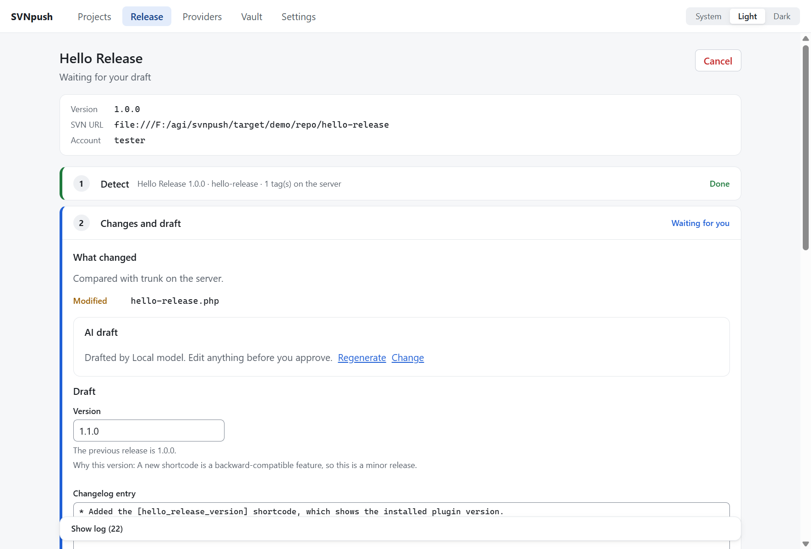
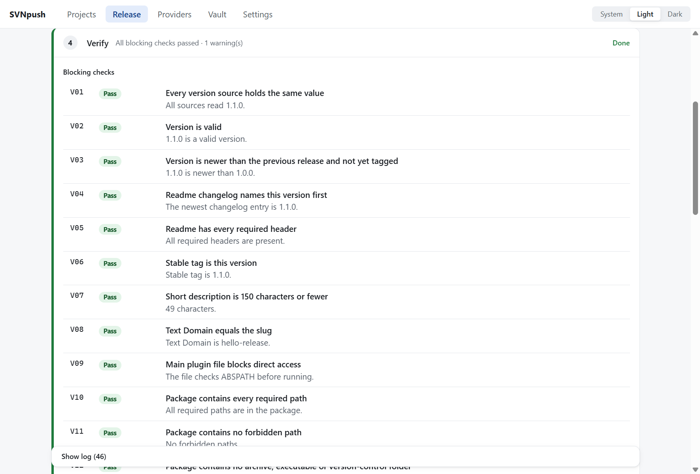
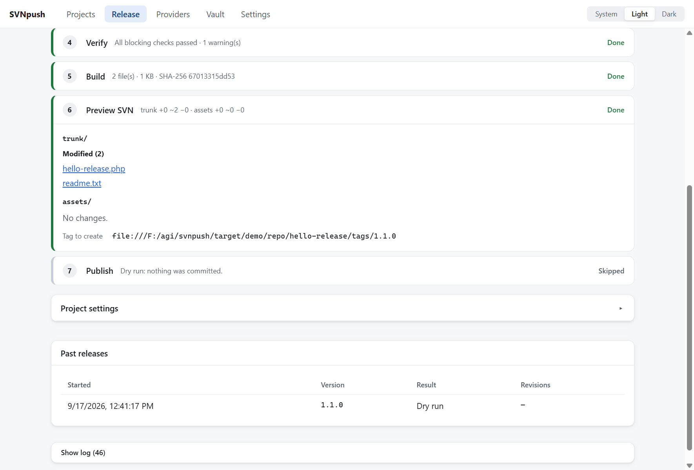
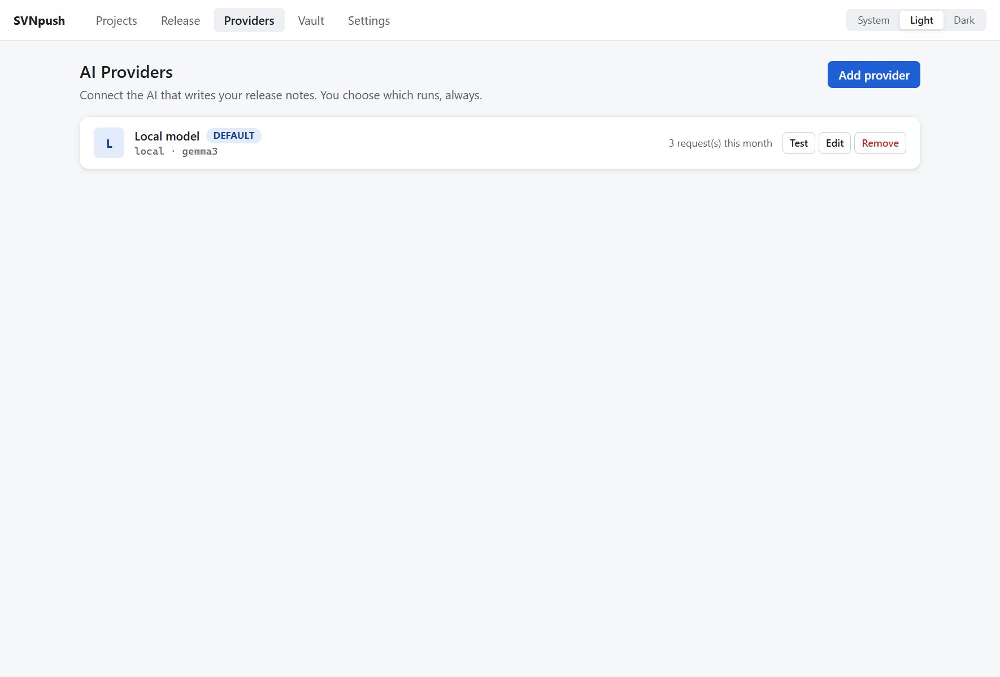

# SVNpush

A desktop app that takes a WordPress plugin from a local folder to a
published WordPress.org release in one click, safely. AI drafts the version
and changelog, deterministic checks decide whether the release may proceed,
and nothing is committed until you click Publish.



## What it does

- **Seven steps, one checklist:** Detect, Changes and draft, Write, Verify,
  Build, Preview SVN, Publish. Each step shows exactly what it did.
- **Every version source in step.** The plugin header, the readme Stable tag,
  the changelog, the upgrade notice, and any extra locations you configure
  (a constant, `package.json`) are written together and shown as a diff.
- **A real gate.** Sixteen blocking checks (V01–V16) and ten warnings
  (W01–W10), each with its fix. A failed blocking check stops the release.
- **AI that you approve.** Your chosen provider suggests the version,
  changelog entry, upgrade notice and summary from what changed. When a
  check fails, it explains why and can suggest readme fixes, applied only
  after you review the diff. AI can be switched off per project, and a
  release never depends on it.
- **Safe SVN.** A sparse working copy, a preview of every added, modified and
  deleted file, then trunk commit, server-side tag, and verification of the
  tag. Before the trunk commit, anything can be cancelled and rolled back.
  After it, Resume creates just the tag.
- **Dry run** rehearses everything up to the SVN preview and leaves your
  files unchanged.
- **Update assets** syncs and commits only banners, icons and screenshots,
  with no version change.



## Requirements

- **Subversion 1.10 or newer.** You don't need to set it up in advance. On first
  launch SVNpush opens **Help** with a setup checklist, and **Install
  Subversion** installs it in one click: through winget on Windows, or
  Homebrew on macOS. The Linux `.deb` and `.rpm` packages install it
  automatically. To do it yourself: `winget install --id Slik.Subversion`,
  `brew install subversion` or `sudo apt install subversion`.
- **Git** (optional): changes are compared with your last git tag, and
  commit subjects feed the draft
- A **WordPress.org plugin** you can commit to, and its **SVN password**

## Install

Download the installer for your platform from the
[latest release](https://github.com/FlyToRakib/svnpush/releases/latest):
`.exe` or `.msi` for Windows, `.dmg` for macOS, `.AppImage` or `.deb` for
Linux. The app checks for signed updates from **Settings → Check for
updates**.

The 1.0 installers are not code-signed:

- **Windows:** SmartScreen shows a warning. Choose *More info → Run anyway*.
- **macOS:** Control-click the app and choose *Open* the first time.

## Your first release

1. **Help → Get ready.** Follow the checklist: Subversion, your SVN
   account, an AI provider (optional) and your plugin. It opens by itself
   the first time.
2. **Vault → add your account.** Use host `plugins.svn.wordpress.org`, your
   WordPress.org username, and your **SVN password** from your WordPress.org
   profile (*Account & Security → Subversion password*), not your account
   password. The password is stored in your operating system keychain.
3. **Providers → Add provider** (optional). Revoye is recommended. You can
   also use Gemini, Claude, OpenAI, OpenRouter, DeepSeek, Qwen, Perplexity,
   any OpenAI-compatible endpoint, or a local model such as Ollama, which
   needs no key. API keys go to the keychain too. **Test** checks the
   connection.
4. **Projects → Add project.** Choose the plugin folder and enter its SVN
   URL, for example `https://plugins.svn.wordpress.org/your-plugin`.
   SVNpush reads the header and readme.
5. **Open the project, turn on Dry run, and click Dry run.** Approve the
   draft and read the checks and the SVN preview. Your files are restored
   afterwards.
6. **Click Release.** Approve the draft, check the preview, and confirm
   **Publish**. The tag is verified on the server and the plugin page opens.



### Project settings

Open **Project settings** on the project page to set:

- the package root, for example `dist`
- the main plugin file
- extra version locations: a file plus a regular expression with one
  capture group
- required paths
- a pre-build command, for example `npm run build`
- the assets folder (`.wordpress-org` by default)
- the SVN account
- the AI provider: default, a specific one, or off
- AI exclude patterns
- post-publish options: a git tag and opening the plugin page

A team can commit the same settings as `.svnpush.json` in the plugin folder.
That file is never packaged.

## Which files are released

Your git repository can keep everything: docs, tests, guides. Only the plugin
itself goes to WordPress.org, decided by a `.distignore` file in the plugin
folder. It uses the same format as `.gitignore`, and is the WordPress
standard also used by WP-CLI and the 10up deploy action.

- **No `.distignore` yet?** On the next release, SVNpush pauses at Build and
  proposes one. It leaves out every hidden file and folder (`.git`,
  `.github`, `.agent`, `.env` …), `docs/`, `tests/`, `node_modules/` and
  developer files like `composer.json` and `package.json`. You see exactly
  what will be released and what is left out, edit the rules if needed, and
  save. Commit the new `.distignore` with your plugin.
- **First release, or new top-level files or folders?** The same check
  appears, with new items marked, so nothing unexpected is published.
- **Secret files are never released.** A `.env` file, a private key or
  `wp-config.php` in the package stops the release (check V11), whatever the
  rules say.
- **Preview SVN** lists every file that will be added, changed or deleted
  before you click Publish.

## Privacy and security

- The SVN password and API keys live only in the OS keychain. They never
  reach a file, a log or the screen. `svn` receives the password on stdin.
- Before a provider receives anything for the first time, SVNpush shows what
  will be sent: diffs of changed files, commit subjects, readme excerpts,
  and the plugin name and versions. Files matching your exclude patterns,
  and files that look like secrets (`.env`, `*.pem`, `*.key`,
  `wp-config.php`), are never sent.
- AI output is plain text that you edit and approve. The AI never runs
  commands or writes files.
- The only other network request is an optional daily lookup of the current
  WordPress version on `api.wordpress.org`, for warning W02. You can turn it
  off in Settings.



## Documentation

- [docs/PROTOCOL.md](docs/PROTOCOL.md): exactly what happens at each step,
  every check, rollback and resume
- [docs/ARCHITECTURE.md](docs/ARCHITECTURE.md): how the code is organised
- [docs/RELEASE.md](docs/RELEASE.md): releasing SVNpush itself
- [docs/PLAN.md](docs/PLAN.md): the specification, and
  [docs/DECISIONS.md](docs/DECISIONS.md): choices made while building it
- [CHANGELOG.md](CHANGELOG.md)

## Development

```bash
npm ci
npm run dev
```

See [CONTRIBUTING.md](CONTRIBUTING.md) for the full check set.

## License

MIT
